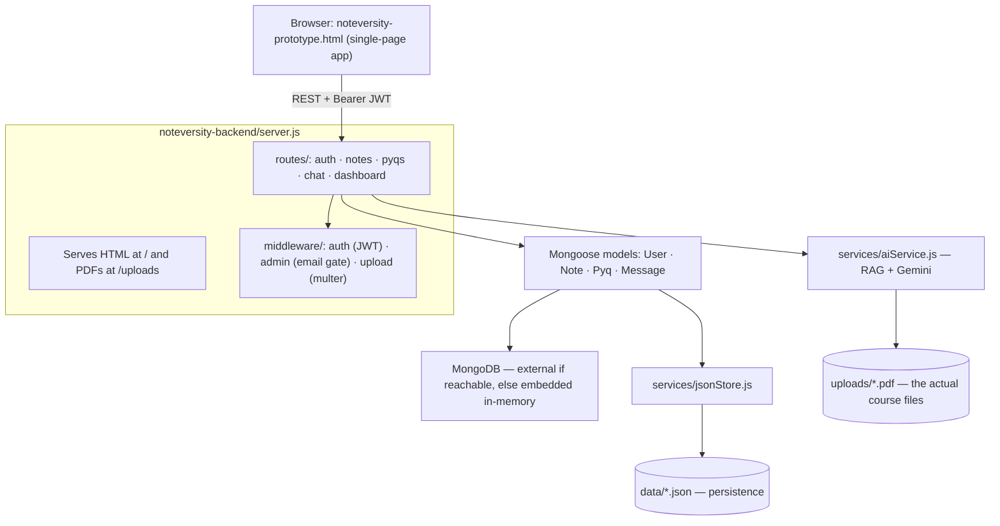

# 🧠 HOW IT WORKS — AKGEC Logic & Architecture Guide

This document explains **how every piece of AKGEC actually works** — the login/auth logic, the ChatBox RAG pipeline, where data is stored, and what every file does. Read this before touching the code.

---

## 1. Big Picture



**Key idea — dual-layer storage:** MongoDB may be in-memory (no setup needed). To survive restarts, every collection is mirrored to JSON files in `data/` on every write, and restored from those files on boot. `uploads/` holds the real PDFs.

---

## 2. Login & Authentication Logic

### Files involved
| File | Role |
|---|---|
| `noteversity-prototype.html` | Login/signup UI, stores token in `localStorage`, attaches `Authorization: Bearer <token>` to every API call |
| `noteversity-backend/routes/auth.js` | `POST /api/auth/signup`, `/login`, `/request-otp`, `/verify-otp`, `/demo-session` |
| `noteversity-backend/middleware/auth.js` | Verifies the JWT on every protected request, extracts `userId` |
| `noteversity-backend/middleware/admin.js` | Upload/delete guard — compares user email against `ADMIN_EMAIL` (`admin@akgec.ac.in`) |
| `noteversity-backend/models/User.js` | User schema (name, email, passwordHash, rollNumber, branch, semester, downloadedNotes/Pyqs) |

### Signup flow (`POST /api/auth/signup`)
1. Frontend validates: name present, email ends with `@akgec.ac.in` (domain comes from `ALLOWED_EMAIL_DOMAIN` in `.env`), password ≥ 6 chars, passwords match. Errors show in a red alert that auto-scrolls into view.
2. Backend re-validates the same rules, hashes the password with **bcryptjs** (10 salt rounds), creates the user, returns a **JWT** (signed with `JWT_SECRET`, expires per `JWT_EXPIRES_IN`, default 7d) plus the user profile.
3. Frontend saves token + user into `localStorage` (`noteversity_token`, `noteversity_user`) and enters the app.

### Login flow (`POST /api/auth/login`)
1. Same domain check → find user by email → bcrypt `compare` → wrong password returns 400 "Incorrect password".
2. On success: JWT + profile returned → same storage as signup.

### Session resume ("Welcome back")
On page load, `initApp()` sees a saved token in localStorage and shows the **"👋 Welcome back"** card. Clicking **Enter Portal** first validates the token with a real call to `/api/dashboard`:
- Valid → enters the app instantly (no re-login).
- Expired/invalid → clears storage and shows "Your previous session expired. Please sign in again."
- Server unreachable → keeps the saved session for retry.

### Admin gate
Upload/delete endpoints call `requireAdmin` (`middleware/admin.js`), which loads the user by `req.userId` and compares `user.email` to `ADMIN_EMAIL`. Non-admins get 403 and the UI simply hides upload/delete buttons for students (`populateUserUI()` in the frontend).

---

## 3. ChatBox Logic (the AI pipeline)

### Files involved
| File | Role |
|---|---|
| `noteversity-prototype.html` (chat section) | Chat UI, subject selector, send/stop button, `formatMarkdown()` (headers, bold, code blocks, **tables**, lists), KaTeX math rendering, typing indicator, abort controller |
| `noteversity-backend/routes/chat.js` | `POST /api/chat/ask`, `GET /api/chat/history`, `DELETE /api/chat/history` |
| `noteversity-backend/services/aiService.js` | The whole RAG brain (details below) |
| `noteversity-backend/services/jsonStore.js` | Persists each user's conversation to `data/chats.json` |
| `noteversity-backend/data/chats.json` | The actual chat storage |

### End-to-end pipeline for one question

```
Student types → POST /api/chat/ask { message, subject }
   │
   ├─ 1. INTENT FILTER (instant, no AI cost)
   │     greetings / thanks / "who are you" → canned reply, return immediately
   │
   ├─ 2. SUBJECT NORMALIZATION
   │     "Operating Systems" → OS-style mapping → one of DAA | AI | AWS | EPJ | TOC | QR | All
   │     (General → All: searches across every subject)
   │
   ├─ 3. CANDIDATE POOL (MongoDB)
   │     subject-specific → top 8 notes + 6 PYQs by downloads
   │     All subjects     → top 40 notes + 20 PYQs (wide net)
   │
   ├─ 4. PDF TEXT EXTRACTION (pdf-parse, cached by file mtime)
   │     every candidate's full text extracted; < 200 chars = scanned/image PDF
   │     → marked "unreadable", excluded from answers honestly
   │
   ├─ 5. IDF-WEIGHTED RELEVANCE SCORING
   │     keywords from the question (stopwords removed, plural-stripped)
   │     weight = 1 + ln(N / (1 + docFrequency))  → common words score low,
   │     rare distinctive words ("bellman") score high  (+15 rare bonus)
   │     + title matches ×10, +25 for the full phrase
   │
   ├─ 6. SELECTION + TARGETED EXCERPTS
   │     top 6 docs by score (fallback: 3 most-downloaded readable docs)
   │     each doc: best-scoring 4,000-char chunks until 24,000 chars
   │     global cap: 100,000 chars of context
   │
   ├─ 7. PROMPT ASSEMBLY (the "faculty" prompt)
   │     repo excerpts + guardrails + mandatory two-part structure:
   │       "### ✍️ How to Write This in Your Exam"   ← always first
   │       "### 📚 Faculty Explanation"               ← then the deep dive
   │     + honest-grounding rule (never claim a doc says what it doesn't)
   │
   ├─ 8. GENERATION WITH FALLBACK
   │     Gemini chain: gemini-3.1-flash-lite → flash-latest → 3.8-flash → 3.7-flash → 3.5-flash
   │     all fail → xAI Grok backup (XAI_API_KEY) → both fail → error message
   │
   └─ 9. RESPONSE
         { reply, subject, modelUsed, sources[] } → frontend renders markdown
         + KaTeX + "📄 Studied" source pills (each links to the actual PDF)
```

### How chat is stored
- Every question and answer is appended to **`noteversity-backend/data/chats.json`**.
- The file is **one JSON object keyed by user id** (`String(userId)` → array of messages). Each message: `{ who, text, me, subject, time, createdAt }` (+ `sources` for AI replies).
- Capped at **150 messages per user** (oldest dropped) to keep the file small.
- `GET /api/chat/history` returns the signed-in user's array; `DELETE /api/chat/history` deletes their key. The frontend "Clear" button calls the DELETE after a confirm dialog.
- Chats are **per-user** — the JWT determines whose history you read/write. Nothing is shared between accounts.

---

## 4. Notes / PYQs & the Library Catalog

- `config/libraryCatalog.js` — the **seed catalog**: `{ notes: [{title, subject, file}], pyqs: [{title, subject, file, year, examType, isSolved}] }` where `file` is relative to `/uploads`.
- On boot, `config/seeder.js`:
  1. Restores users/notes/PYQs from `data/*.json` if present (your data survives restarts).
  2. Otherwise seeds the catalog — **skipping entries whose PDF is missing** from `uploads/` (so a fresh clone with no PDFs stays clean).
  3. Purges retired subjects (DBMS/OS/CN/DM) on every boot.
  4. **Auto-import**: scans `uploads/*.pdf` on *every* boot. Any PDF not already in the DB is imported — subject from the filename prefix (`AI_Unit_1.pdf` → AI), title from the filename (underscores → spaces). Files that look like exam papers (mid/exam/paper/question bank) go to the PYQ bank. Unknown prefixes are skipped with a console note.
- Downloads: `POST /api/notes/:id/download` increments the counter, records it on the user's dashboard, and the frontend triggers the browser download.
- Admin delete unlinks the physical file too.

---

## 5. File-by-File Responsibility

### Root
| File | What it does |
|---|---|
| `start.bat` | Windows one-click launcher: checks Node, copies `.env.example` → `.env` if missing, `npm install` if needed, frees port 5000, opens browser |
| `noteversity-prototype.html` | The entire frontend SPA (login, dashboard, notes, PYQs, chat, profile, dark mode, mobile layout) |
| `README.md` | Setup guide, features, architecture overview |
| `HOW_IT_WORKS.md` | This file |
| `CHANGES_AND_ARCHITECTURE.md` | Historical changelog of major structural changes |

### noteversity-backend/
| File | What it does |
|---|---|
| `server.js` | Express entrypoint: CORS, static `/uploads`, serves the HTML, mounts routes, health check |
| `config/db.js` | Connects to `MONGO_URI`; falls back to an embedded in-memory MongoDB if unreachable; runs the seeder |
| `config/seeder.js` | Restores/seed data, purges retired subjects, auto-imports new PDFs from `uploads/` |
| `config/libraryCatalog.js` | The seed catalog of course PDFs (title/subject/file entries) |
| `config/mailer.js` | Nodemailer OTP email with a console fallback in dev |
| `middleware/auth.js` | JWT verification for protected routes |
| `middleware/admin.js` | Admin-only gate (email comparison against `ADMIN_EMAIL`) |
| `middleware/upload.js` | Multer disk storage for uploads (20 MB limit, extension filter) |
| `models/User.js` | User schema: name, email, passwordHash, roll, branch, semester, downloads |
| `models/Note.js` | Note schema: title, subject, fileUrl, uploadedBy, downloads |
| `models/Pyq.js` | PYQ schema: + year, examType enum, isSolved |
| `models/Message.js` | Legacy room-chat schema (mostly unused; per-user chats live in JSON) |
| `routes/auth.js` | signup / login / OTP / demo-session endpoints |
| `routes/notes.js` | List, upload (admin), delete (admin), download+track |
| `routes/pyqs.js` | Same for PYQs |
| `routes/chat.js` | AI ask endpoint + per-user history get/clear |
| `routes/dashboard.js` | One call feeding the dashboard: stats, recent downloads, profile |
| `services/aiService.js` | The RAG engine: intent filter → retrieval → scoring → excerpts → prompt → Gemini/xAI |
| `services/jsonStore.js` | Read/write/sync the JSON persistence layer + per-user chat storage |
| `data/*.json` | **Runtime persistence** (gitignored): users, notes, pyqs, chats keyed by user id |
| `uploads/*.pdf` | **The actual course PDFs** (gitignored) served at `/uploads/...` |

---

## 6. Environment Variables (noteversity-backend/.env)

| Variable | Purpose |
|---|---|
| `PORT` | Server port (default 5000) |
| `MONGO_URI` | External MongoDB; embedded in-memory fallback if unreachable |
| `JWT_SECRET` / `JWT_EXPIRES_IN` | Token signing |
| `ALLOWED_EMAIL_DOMAIN` | Only emails ending in `@<domain>` may sign up/log in |
| `GEMINI_API_KEY` / `GEMINI_MODEL` | Primary AI provider |
| `XAI_API_KEY` / `XAI_MODEL` | Optional backup provider when all Gemini models fail |
| `SMTP_*` | Optional OTP email delivery (dev fallback logs OTP to console) |
